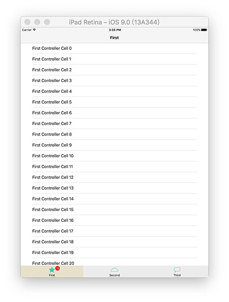
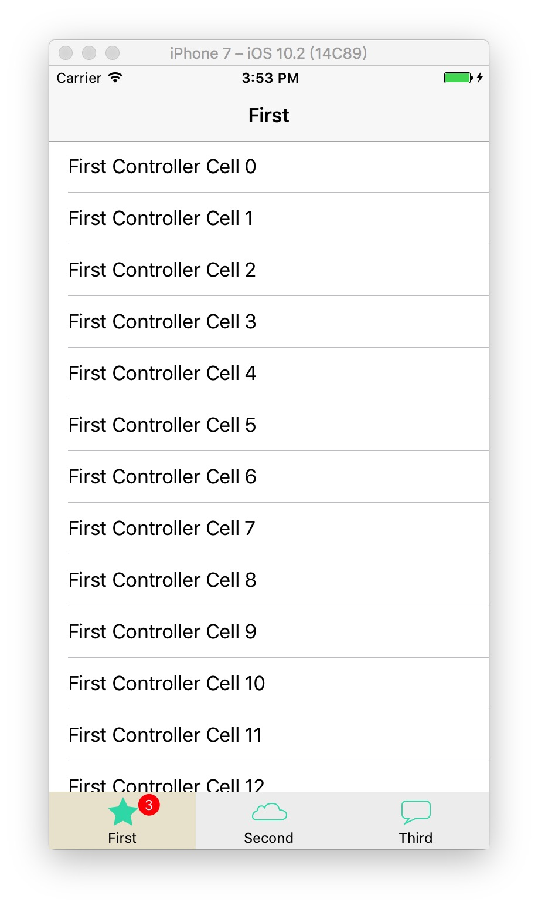

# RDVTabBarControllerSwift

[](https://travis-ci.org/chenjiang/RDVTabBarControllerSwift)
[](http://cocoapods.org/pods/RDVTabBarControllerSwift)
[](http://cocoapods.org/pods/RDVTabBarControllerSwift)
[](http://cocoapods.org/pods/RDVTabBarControllerSwift)

[](Screenshots/iPad.png)

[](Screenshots/iPhone.png)

* Supports iPad and iPhone
* Supports landscape and portrait orientations
* Can be used inside UINavigationController
* Customizable badges

## Example Usage

#### Initialize RDVTabBarController
The initialization is similar to the one for `UITabBarController`. Create an instance of the `tabBarController` and initialize its `viewControllers`.

```c
let firstViewController = RDVFirstViewController(nibName: nil, bundle: nil)
let firstNavigationController = UINavigationController(rootViewController: firstViewController)

let secondViewController = RDVSecondViewController(nibName: nil, bundle: nil)
let secondNavigationController = UINavigationController(rootViewController: secondViewController)

let thirdViewController = RDVThirdViewController(nibName: nil, bundle: nil)
let thirdNavigationController = UINavigationController(rootViewController: thirdViewController)

let tabBarController = RDVTabBarController()
tabBarController.viewControllers = [firstNavigationController, secondNavigationController, thirdNavigationController]

self.viewController = tabBarController

```

#### Customize RDVTabBarController
Each `RDVTabBarItem` has `selectedBackground`, `unselectedBackground` and corresponding properties for the icons: `selectedImage` and `unselectedImage`.
```c
func customizeTabBarForController(_ tabBarController: RDVTabBarController) {
    guard let items = tabBarController.tabBar.items else {
        return
    }

    let finishedImage = UIImage(named: "tabbar_selected_background")
    let unfinishedImage = UIImage(named: "tabbar_normal_background")
    let tabBarItemImages = ["first", "second", "third"]

    var index = 0
    for item in items {
        item.setBackgroundSelectedImage(finishedImage, unselectedImage: unfinishedImage)
        let selectedimage = UIImage(named: "\(tabBarItemImages[index])_selected")
        let unselectedimage = UIImage(named: "\(tabBarItemImages[index])_normal")
        item.setFinishedSelectedImage(selectedimage, unselectedImage: unselectedimage)

        index += 1
    }
}
```
#### Make the tab bar translucent
`RDVTabBar` has `translucent` property which determines how it is going to be handled.

```c
let tabBar = tabBarController.tabBar

// After the tabBarController initialization
tabBar.translucent = true

// Customize the tabBar background
tabBar.backgroundView.backgroundColor = UIColor(red: 245/255.0,
                                                        green: 245/255.0,
                                                        blue: 245/255.0,
                                                        alpha: 0.9)
// Inside the tabbed viewControllers
if let tabBar = self.rdv_tabBarController?.tabBar, tabBar.translucent == true {
    let insets = UIEdgeInsets(top: 0, left: 0,
                                      bottom: tabBar.frame.height,
                                      right: 0)
    self.tableView.contentInset = insets
    self.tableView.scrollIndicatorInsets = insets
}
```

## Requirements
* Swift3.0
* iOS 8.0 or later
* Xcode 8

## Installation

### CocoaPods
RDVTabBarControllerSwift is available through [CocoaPods](http://cocoapods.org). To install
it, simply add the following line to your Podfile:

```ruby
pod "RDVTabBarControllerSwift"
```

### Drag & Drop
Add the items from `RDVTabBarControllerSwift` directory to your project.

## Author

chenjiang, 841346457@qq.com
qq: 841346457

## License

RDVTabBarControllerSwift is available under the MIT license. See the LICENSE file for more info.
